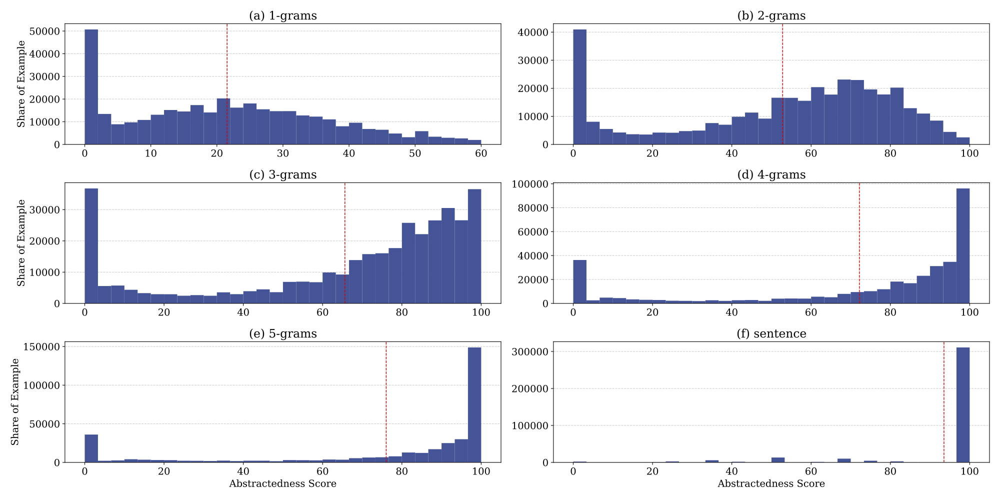
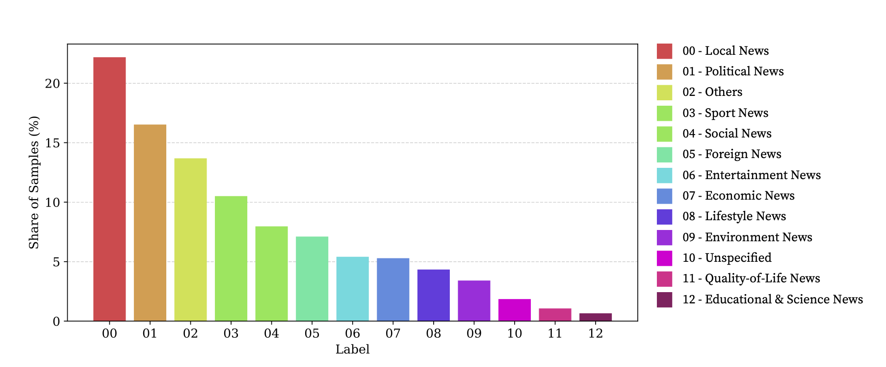
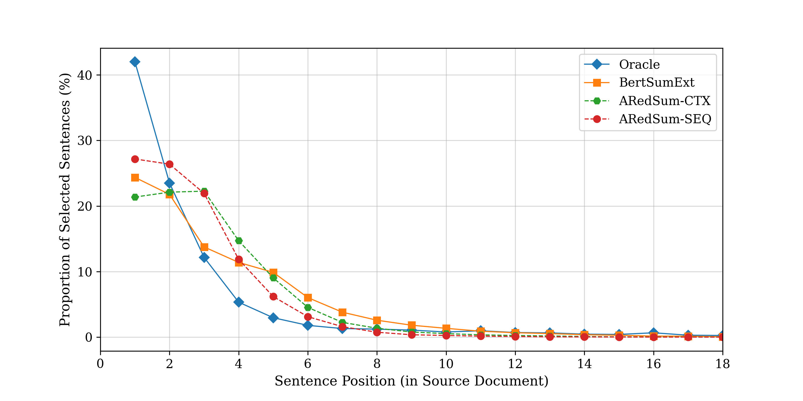

# ThaiSum
A dataset for Thai text summarization.

**Notes** <br>
- ThaiSum คือชุดข้อมูลสำหรับเทรนระบบสรุปข้อความภาษาไทย จากเว็บไซต์ ไทยรัฐ, ไทยพีบีเอส, ประชาไท และ เดอะแสตนดาร์ด
- ผู้สนใจยังสามารถดาวน์โหลด โมเดลที่เทรนแล้วไปทดสอบกับ test set ของท่าน โดยเราได้ modify ซอร์ซโค้ดของ BertSum และ ARedSum ให้รองรับภาษาไทย ศึกษาเพิ่มเติมได้ที่ [ARedSum_for_Thai_text.ipynb](ARedSum_for_Thai_text.ipynb) และ [BertSum_for_Thai_text.ipynb](BertSum_for_Thai_text.ipynb) ทั้งนี้ท่านต้อง process ข้อความของท่านเองให้เหมาะกับแต่ละโมเมลโดยเรามีตัวอย่างไว้ให้แล้ว
- เราระบุที่มาของทุกข่าวในชุดข้อมูลนี้ในคอลัมน์ url หากท่านต้องการดัดแปลงและเผยแพร่ชุดข้อมูลนี้ต่อ กรุณาใส่ที่มาของทุกๆบทความด้วย
- ชุดข้อมูลนี้ยังเป็นประโยชน์ต่อระบบประมวลผลทางภาษาไทยอื่นๆเช่น news classification (ทั้งแบบ multi-label และ single-label), headline generation, language modelling
 
# 0. Download
## 0.1 Dataset
|Dataset|Remark|
|:---|:---|
|[thaisum.csv](https://docs.google.com/forms/d/e/1FAIpQLSdq7nnJ5rob6tXWp6EstZ4oDbzdxTCHkwwinbJGmcj7O2q7nQ/viewform?usp=sf_link)|contains `title`, `body`, `summary`, `type`, `tags`, `url` columns. (2.9 GB)|
|[test_set.csv](https://nakhun-chumpolsathien.oss-us-west-1.aliyuncs.com/thaisum/test_set.csv)|contain `title`, `body`, `summary`, `type`, `tags`, `url` columns. (113 MB)|
|[validation_set.csv](https://nakhun-chumpolsathien.oss-us-west-1.aliyuncs.com/thaisum/validation_set.csv)|contain `title`, `body`, `summary`, `type`, `tags`, `url` columns. (113 MB)|

## 0.2 Trained Models
### 0.2.1 BertSum
|Model|Size|
|:---|:---|
|[BertSumExt](https://nakhun-chumpolsathien.oss-us-west-1.aliyuncs.com/thaisum/bertsum_models/BertsumExt_thaisum.pt)|2.1 GB |
|[BertSumAbs](https://nakhun-chumpolsathien.oss-us-west-1.aliyuncs.com/thaisum/bertsum_models/BertSumAbs-thaisum.pt)|3.6 GB |
|[BertSumExtAbs](https://nakhun-chumpolsathien.oss-us-west-1.aliyuncs.com/thaisum/bertsum_models/BertSumExtAbs-thaisum.pt)|3.6 GB |
### 0.2.2 ARedSum
|Model|Size|
|:---|:---|
|[ARedSumBase](https://nakhun-chumpolsathien.oss-us-west-1.aliyuncs.com/thaisum/aredsum_models/ARedSum_base.pt)|2.1 GB |
|[ARedSumCTX](https://nakhun-chumpolsathien.oss-us-west-1.aliyuncs.com/thaisum/aredsum_models/ARedSum_CTX.pt)|737.6 MB |
|[ARedSumSEQ](https://nakhun-chumpolsathien.oss-us-west-1.aliyuncs.com/thaisum/aredsum_models/ARedSum_SEQ.pt)|2.3 GB |

## 0.3 Source Code Credit
|Model|Original Source| Paper|
|:---|:---:|:---:|
|BertSum|[GitHub](https://github.com/nlpyang/PreSumm)|[aclweb](https://www.aclweb.org/anthology/D19-1387)|
|ARedSum|[GitHub](https://github.com/kepingbi/ARedSumSentRank)|[arXiv](https://arxiv.org/abs/2004.06176)|
# 1. Introduction
Sequence-to-sequence (Seq2Seq) models have shown great achievement in text summarization. However, Seq2Seq model often requires large-scale training data to achieve effective results. Although many impressive advancements in text summarization field have been made, most of summarization studies focus on resource-rich languages. The progress of Thai text summarization is still far behind. The dearth of large-scale dataset keeps Thai text summarization in its infancy. As far as our knowledge goes, there is not a large-scale dataset for Thai text summarization available anywhere. Thus, we present ThaiSum, a large-scale corpus for Thai text summarization obtained from several online news websites namely [Thairath](https://www.thairath.co.th/), [ThaiPBS](https://www.thaipbs.or.th/home), [Prachathai](https://prachatai.com/), and [The Standard](https://thestandard.co/). This dataset consists of over 350,000 article and summary pairs written by journalists. We evaluate the performance of various existing summarization models on ThaiSum dataset and analyse the characteristic of the dataset to present its difficulties.
# 2. Dataset Construction
We used a python library named Scrapy to crawl articles from several news websites namely Thairath, Prachatai, ThaiPBS and, The Standard. We first collected news URLs provided in their sitemaps. During web-crawling, we used HTML markup and metadata available in HTML pages to identify article text, summary, headline, tags and label. Collected articles were published online from 2014 to August 2020.  <br> <br>
We further performed data cleansing process to minimize noisy data. We filtered out articles that their article text or summary is missing. Articles that contains article text with less than 150 words or summary with less than 15 words were removed. We also discarded articles that contain at least one of these following tags: ‘ดวง’ (horoscope), ‘นิยาย’ (novel), ‘อินสตราแกรมดารา’ (celebrity Instagram), ‘คลิปสุดฮา’(funny video) and ‘สรุปข่าว’ (highlight news). Some summaries were completely irrelevant to their original article texts. To eliminate those irrelevant summaries, we calculated abstractedness score between summary and its article text. Abstractedness score is written formally as: <br>
<center><a href="https://www.codecogs.com/eqnedit.php?latex=\begin{equation}&space;\frac{|S-A|}{r}&space;\times&space;100&space;\end{equation}" target="_blank"></a></center><br>
<br>Where 𝑆 denotes set of article tokens. 𝐴 denotes set of summary tokens. 𝑟 denotes a total number of summary tokens. We omitted articles that have abstractedness score at 1-grams higher than 60%. 
<br><br>

It is important to point out that we used [PyThaiNLP](https://github.com/PyThaiNLP/pythainlp), version 2.2.4, tokenizing engine = newmm, to process Thai texts in this study. It is challenging to tokenize running Thai text into words or sentences because there are not clear word/sentence delimiters in Thai language. Therefore, using different tokenization engines may result in different segment of words/sentences. 

# 3. Dataset Property
After data-cleansing process, ThaiSum dataset contains over 358,000 articles. The size of this dataset is comparable to a well-known English document summarization dataset, CNN/Dily mail dataset. Moreover, we analyse the characteristics of this dataset by measuring the abstractedness level, compassion rate, and content diversity.  For more details, see [thaisum_exploration.ipynb](thaisum_exploration.ipynb).

## 3.1 Dataset Statistics
ThaiSum dataset consists of 358,868 articles. Average lengths of article texts and summaries are approximately 530 and 37 words respectively. As mentioned earlier, we also collected headlines, tags and labels provided in each article. Tags are similar to keywords of the article. An article normally contains several tags but a few labels. Tags can be name of places or persons that article is about while labels indicate news category (politic, entertainment, etc.). Ultimatly, ThaiSum contains 538,059 unique tags and 59 unique labels. Note that not every article contains tags or labels. 

|Dataset Size| 358,868 | 	articles |
|:---|---:|---:|
|Avg. Article Length| 	529.5	| words| 
|Avg. Summary Length	| 37.3	| words| 
|Avg. Headline Length | 	12.6	| words| 
|Unique Vocabulary Size	| 407,355	| words| 
|Occurring > 10 times	| 81,761	| words| 
|Unique News Tag Size | 	538,059	| tags| 
|Unique News Label Size	| 59	| labels| 

## 3.2 Level of Abstractedness
The abstractedness level of a summary is determined by measuring the unique n-grams in the reference summary that are not appear in the article text. Figure 1 reports distributions of abstractedness scores at N-grams where N ranks from 1 – 5 and sentences.

> Figure 1: Red vertical line represents average abstractedness score at N-gram. 
## 3.3 Content Diversity
See [assign_final_label_to_article.py](assign_final_label_to_article.py) for how we assign final label to the article. This could be useful for news classification task.


# 4. Experiment and Result
This experiment aims to create benchmarks for ThaiSum dataset by using some existing state-of-the-art summarization models on both extractive and abstractive settings. 
## 4.1 Experimental Settings
To train sequence-to-sequence based models, we split the dataset into 336,868/11,000/11,000 documents for training, validation and testing. Input documents were truncated at 500 words. We used 'bert-base-multilingual-uncased' for fine-tuning. We trained BertSum and ARedSum models on two GPUs (NVIDIA Titan RTX). Other parameters were set similar to the oiginal experiments of the corresponding papers. The summaries produced by extractive models, except ORACLE, were limited to 2 sentences.
## 4.2 Performance of Existing Systems
### 4.2.1 Automatic Metric Evaluation
<table style="border-collapse:collapse;border-spacing:0" class="tg"><thead><tr><th style="border-color:inherit;border-style:solid;border-width:1px;font-family:Arial, sans-serif;font-size:14px;font-weight:normal;overflow:hidden;padding:10px 5px;text-align:center;vertical-align:top;word-break:normal" rowspan="2">Model<br></th><th style="border-color:inherit;border-style:solid;border-width:1px;font-family:Arial, sans-serif;font-size:14px;font-weight:normal;overflow:hidden;padding:10px 5px;text-align:center;vertical-align:top;word-break:normal" colspan="3">ROUGE</th><th style="border-color:inherit;border-style:solid;border-width:1px;font-family:Arial, sans-serif;font-size:14px;font-weight:normal;overflow:hidden;padding:10px 5px;text-align:center;vertical-align:top;word-break:normal">BertScore</th></tr><tr><td style="border-color:inherit;border-style:solid;border-width:1px;font-family:Arial, sans-serif;font-size:14px;overflow:hidden;padding:10px 5px;text-align:center;vertical-align:top;word-break:normal">R1</td><td style="border-color:inherit;border-style:solid;border-width:1px;font-family:Arial, sans-serif;font-size:14px;overflow:hidden;padding:10px 5px;text-align:center;vertical-align:top;word-break:normal">R2</td><td style="border-color:inherit;border-style:solid;border-width:1px;font-family:Arial, sans-serif;font-size:14px;overflow:hidden;padding:10px 5px;text-align:center;vertical-align:top;word-break:normal">RL</td><td style="border-color:inherit;border-style:solid;border-width:1px;font-family:Arial, sans-serif;font-size:14px;overflow:hidden;padding:10px 5px;text-align:center;vertical-align:top;word-break:normal">F1</td></tr></thead><tbody><tr><td style="border-color:black;border-style:solid;border-width:1px;font-family:Arial, sans-serif;font-size:14px;overflow:hidden;padding:10px 5px;text-align:center;vertical-align:top;word-break:normal" colspan="5"><center>Baselines</center></td></tr><tr><td style="border-color:inherit;border-style:solid;border-width:1px;font-family:Arial, sans-serif;font-size:14px;overflow:hidden;padding:10px 5px;text-align:left;vertical-align:top;word-break:normal">Oracle</td><td style="border-color:inherit;border-style:solid;border-width:1px;font-family:Arial, sans-serif;font-size:14px;overflow:hidden;padding:10px 5px;text-align:center;vertical-align:top;word-break:normal">52.65</td><td style="border-color:inherit;border-style:solid;border-width:1px;font-family:Arial, sans-serif;font-size:14px;overflow:hidden;padding:10px 5px;text-align:center;vertical-align:top;word-break:normal">28.34</td><td style="border-color:inherit;border-style:solid;border-width:1px;font-family:Arial, sans-serif;font-size:14px;overflow:hidden;padding:10px 5px;text-align:center;vertical-align:top;word-break:normal">52.25</td><td style="border-color:inherit;border-style:solid;border-width:1px;font-family:Arial, sans-serif;font-size:14px;overflow:hidden;padding:10px 5px;text-align:center;vertical-align:top;word-break:normal">82.83</td></tr><tr><td style="border-color:inherit;border-style:solid;border-width:1px;font-family:Arial, sans-serif;font-size:14px;overflow:hidden;padding:10px 5px;text-align:left;vertical-align:top;word-break:normal">Lead2</td><td style="border-color:inherit;border-style:solid;border-width:1px;font-family:Arial, sans-serif;font-size:14px;overflow:hidden;padding:10px 5px;text-align:center;vertical-align:top;word-break:normal">42.74</td><td style="border-color:inherit;border-style:solid;border-width:1px;font-family:Arial, sans-serif;font-size:14px;overflow:hidden;padding:10px 5px;text-align:center;vertical-align:top;word-break:normal">25.58</td><td style="border-color:inherit;border-style:solid;border-width:1px;font-family:Arial, sans-serif;font-size:14px;overflow:hidden;padding:10px 5px;text-align:center;vertical-align:top;word-break:normal">42.69</td><td style="border-color:inherit;border-style:solid;border-width:1px;font-family:Arial, sans-serif;font-size:14px;overflow:hidden;padding:10px 5px;text-align:center;vertical-align:top;word-break:normal">83.28</td></tr><tr><td style="border-color:inherit;border-style:solid;border-width:1px;font-family:Arial, sans-serif;font-size:14px;overflow:hidden;padding:10px 5px;text-align:left;vertical-align:top;word-break:normal">Lead2+Trigram</td><td style="border-color:inherit;border-style:solid;border-width:1px;font-family:Arial, sans-serif;font-size:14px;overflow:hidden;padding:10px 5px;text-align:center;vertical-align:top;word-break:normal">42.23</td><td style="border-color:inherit;border-style:solid;border-width:1px;font-family:Arial, sans-serif;font-size:14px;overflow:hidden;padding:10px 5px;text-align:center;vertical-align:top;word-break:normal">25.03</td><td style="border-color:inherit;border-style:solid;border-width:1px;font-family:Arial, sans-serif;font-size:14px;overflow:hidden;padding:10px 5px;text-align:center;vertical-align:top;word-break:normal">42.18</td><td style="border-color:inherit;border-style:solid;border-width:1px;font-family:Arial, sans-serif;font-size:14px;overflow:hidden;padding:10px 5px;text-align:center;vertical-align:top;word-break:normal">83.24</td></tr><tr><td style="border-color:black;border-style:solid;border-width:1px;font-family:Arial, sans-serif;font-size:14px;overflow:hidden;padding:10px 5px;text-align:center;vertical-align:top;word-break:normal" colspan="5"><center>Extractive</center></td></tr><tr><td style="border-color:inherit;border-style:solid;border-width:1px;font-family:Arial, sans-serif;font-size:14px;overflow:hidden;padding:10px 5px;text-align:left;vertical-align:top;word-break:normal">ARedSum-Base</td><td style="border-color:inherit;border-style:solid;border-width:1px;font-family:Arial, sans-serif;font-size:14px;overflow:hidden;padding:10px 5px;text-align:center;vertical-align:top;word-break:normal">43.86</td><td style="border-color:inherit;border-style:solid;border-width:1px;font-family:Arial, sans-serif;font-size:14px;overflow:hidden;padding:10px 5px;text-align:center;vertical-align:top;word-break:normal">25.65</td><td style="border-color:inherit;border-style:solid;border-width:1px;font-family:Arial, sans-serif;font-size:14px;overflow:hidden;padding:10px 5px;text-align:center;vertical-align:top;word-break:normal">43.80</td><td style="border-color:inherit;border-style:solid;border-width:1px;font-family:Arial, sans-serif;font-size:14px;overflow:hidden;padding:10px 5px;text-align:center;vertical-align:top;word-break:normal">80.66</td></tr><tr><td style="border-color:inherit;border-style:solid;border-width:1px;font-family:Arial, sans-serif;font-size:14px;overflow:hidden;padding:10px 5px;text-align:left;vertical-align:top;word-break:normal">ARedSum-CTX</td><td style="border-color:inherit;border-style:solid;border-width:1px;font-family:Arial, sans-serif;font-size:14px;overflow:hidden;padding:10px 5px;text-align:center;vertical-align:top;word-break:normal">40.72</td><td style="border-color:inherit;border-style:solid;border-width:1px;font-family:Arial, sans-serif;font-size:14px;overflow:hidden;padding:10px 5px;text-align:center;vertical-align:top;word-break:normal">24.17</td><td style="border-color:inherit;border-style:solid;border-width:1px;font-family:Arial, sans-serif;font-size:14px;overflow:hidden;padding:10px 5px;text-align:center;vertical-align:top;word-break:normal">40.67</td><td style="border-color:inherit;border-style:solid;border-width:1px;font-family:Arial, sans-serif;font-size:14px;overflow:hidden;padding:10px 5px;text-align:center;vertical-align:top;word-break:normal">79.48</td></tr><tr><td style="border-color:inherit;border-style:solid;border-width:1px;font-family:Arial, sans-serif;font-size:14px;overflow:hidden;padding:10px 5px;text-align:left;vertical-align:top;word-break:normal">ARedSum-SEQ</td><td style="border-color:inherit;border-style:solid;border-width:1px;font-family:Arial, sans-serif;font-size:14px;overflow:hidden;padding:10px 5px;text-align:center;vertical-align:top;word-break:normal">43.06</td><td style="border-color:inherit;border-style:solid;border-width:1px;font-family:Arial, sans-serif;font-size:14px;overflow:hidden;padding:10px 5px;text-align:center;vertical-align:top;word-break:normal">24.48</td><td style="border-color:inherit;border-style:solid;border-width:1px;font-family:Arial, sans-serif;font-size:14px;overflow:hidden;padding:10px 5px;text-align:center;vertical-align:top;word-break:normal">43.01</td><td style="border-color:inherit;border-style:solid;border-width:1px;font-family:Arial, sans-serif;font-size:14px;overflow:hidden;padding:10px 5px;text-align:center;vertical-align:top;word-break:normal">81.07</td></tr><tr><td style="border-color:inherit;border-style:solid;border-width:1px;font-family:Arial, sans-serif;font-size:14px;overflow:hidden;padding:10px 5px;text-align:left;vertical-align:top;word-break:normal">BertSumExt</td><td style="border-color:inherit;border-style:solid;border-width:1px;font-family:Arial, sans-serif;font-size:14px;overflow:hidden;padding:10px 5px;text-align:center;vertical-align:top;word-break:normal">44.39</td><td style="border-color:inherit;border-style:solid;border-width:1px;font-family:Arial, sans-serif;font-size:14px;overflow:hidden;padding:10px 5px;text-align:center;vertical-align:top;word-break:normal">26.58</td><td style="border-color:inherit;border-style:solid;border-width:1px;font-family:Arial, sans-serif;font-size:14px;overflow:hidden;padding:10px 5px;text-align:center;vertical-align:top;word-break:normal">44.34</td><td style="border-color:inherit;border-style:solid;border-width:1px;font-family:Arial, sans-serif;font-size:14px;overflow:hidden;padding:10px 5px;text-align:center;vertical-align:top;word-break:normal">78.82</td></tr><tr><td style="border-color:black;border-style:solid;border-width:1px;font-family:Arial, sans-serif;font-size:14px;overflow:hidden;padding:10px 5px;text-align:center;vertical-align:top;word-break:normal" colspan="5"><center>Abstractive</center></td></tr><tr><td style="border-color:inherit;border-style:solid;border-width:1px;font-family:Arial, sans-serif;font-size:14px;overflow:hidden;padding:10px 5px;text-align:left;vertical-align:top;word-break:normal">BertSumAbs</td><td style="border-color:inherit;border-style:solid;border-width:1px;font-family:Arial, sans-serif;font-size:14px;overflow:hidden;padding:10px 5px;text-align:center;vertical-align:top;word-break:normal">48.82</td><td style="border-color:inherit;border-style:solid;border-width:1px;font-family:Arial, sans-serif;font-size:14px;overflow:hidden;padding:10px 5px;text-align:center;vertical-align:top;word-break:normal">29.70</td><td style="border-color:inherit;border-style:solid;border-width:1px;font-family:Arial, sans-serif;font-size:14px;overflow:hidden;padding:10px 5px;text-align:center;vertical-align:top;word-break:normal">48.75</td><td style="border-color:inherit;border-style:solid;border-width:1px;font-family:Arial, sans-serif;font-size:14px;overflow:hidden;padding:10px 5px;text-align:center;vertical-align:top;word-break:normal">84.58</td></tr><tr><td style="border-color:inherit;border-style:solid;border-width:1px;font-family:Arial, sans-serif;font-size:14px;overflow:hidden;padding:10px 5px;text-align:left;vertical-align:top;word-break:normal"><b>BertSumExtAbs</b></td><td style="border-color:inherit;border-style:solid;border-width:1px;font-family:Arial, sans-serif;font-size:14px;font-weight:bold;overflow:hidden;padding:10px 5px;text-align:center;vertical-align:top;word-break:normal"><b>49.52</b></td><td style="border-color:inherit;border-style:solid;border-width:1px;font-family:Arial, sans-serif;font-size:14px;font-weight:bold;overflow:hidden;padding:10px 5px;text-align:center;vertical-align:top;word-break:normal"><b>29.86</b></td><td style="border-color:inherit;border-style:solid;border-width:1px;font-family:Arial, sans-serif;font-size:14px;font-weight:bold;overflow:hidden;padding:10px 5px;text-align:center;vertical-align:top;word-break:normal"><b>49.48</b></td><td style="border-color:inherit;border-style:solid;border-width:1px;font-family:Arial, sans-serif;font-size:14px;font-weight:bold;overflow:hidden;padding:10px 5px;text-align:center;vertical-align:top;word-break:normal"><b>85.85</b></td></tr></tbody></table>

[](dfd)
> ROUGE-F1 and BertScore-F1 score on test set.
### 4.2.2 Position of Extracted Sentences
Most extractive models heavily select the first three sentences of the articles as the output summary. This is very common especially on news dataset (similar to CNN/Daily Mail dataset) where the articles are written in [inverted pyramid style](https://en.wikipedia.org/wiki/Inverted_pyramid_(journalism)#/media/File:Inverted_pyramid_2.svg). The first few sentences of news articles contain the important information making Lead-3 baselines perform impressively well. 

>Figure 3: Proportion of extracted sentences according
to their position in the original document.

### 4.2.3 Influence of Sentence Segmenter
See [simple_thai_sentence_segmentation.py](simple_thai_sentence_segmentation.py) for our simple Thai sentence segmenter. <br><br>
As mentioned earlier, it is difficult (and sometimes flexible) to pinpoint the end of the sentences from running Thai text. We investigate how different sentence segmentation engines affect the performance of the summarization models. We found that sentence segmenter from ThaiNLP sometimes generates unnecessarily long sentences. Thus, we create a simple Thai sentence segmenter considering conjunction words and length of the sentences. We compared ROUGE-F1 results on same test set but segmented by different sentence segmenters. Note that, for BertSumExt, training and validation sets were also segmented by different segmenter not just test set. Table below shows the comparison results. In short, different sentence segmenters affect significantly the performance of extractive models.
<table class="tg"><thead> <tr> <th class="tg-baqh" rowspan="2"><center>Model</center></th> <th class="tg-baqh" colspan="3"><center>ThaiNLP</center></th> <th class="tg-baqh" colspan="3"><center>Our Segmenter</center></th> </tr> <tr> <td class="tg-baqh"><center>R1</center></td> <td class="tg-baqh"><center>R2</center></td> <td class="tg-baqh"><center>RL</center></td> <td class="tg-baqh"><center>R1</center></td> <td class="tg-baqh"><center>R2</center></td> <td class="tg-baqh"><center>RL</center></td> </tr></thead><tbody> <tr> <td class="tg-0lax">Oracle<br></td> <td class="tg-baqh">52.65</td> <td class="tg-baqh">28.34</td> <td class="tg-baqh">52.25</td> <td class="tg-t2cw"><u><b>63.06</b></u></td> <td class="tg-t2cw"><u><b>35.93</b></u></td> <td class="tg-t2cw"><u><b>62.94</b></u></td> </tr> <tr> <td class="tg-0lax">Lead-2</td> <td class="tg-baqh">42.74</td> <td class="tg-baqh">25.58</td> <td class="tg-baqh">42.69</td> <td class="tg-t2cw"><u><b>52.72</b></u></td> <td class="tg-t2cw"><u><b>31.13</b></u></td> <td class="tg-t2cw"><u><b>52.67</b></u></td> </tr> <tr> <td class="tg-0lax">BertSumExt</td> <td class="tg-t2cw"><u><b>44.39</b></u></td> <td class="tg-t2cw"><u><b>26.58</b></u></td> <td class="tg-t2cw"><u><b>44.34</b></u></td> <td class="tg-baqh">42.70</td> <td class="tg-baqh">25.91</td> <td class="tg-baqh">42.63</td> </tr></tbody></table>

# 5. Licence
- ThaiSum dataset is licensed under [MIT Licence]().
- Trained models are licensed under [Educational Community Licence](https://opensource.org/licenses/ECL-2.0).
- Modified BertSum and ARedSum codes are licensed under thier original licences [MIT Licence](https://github.com/nlpyang/PreSumm/blob/master/LICENSE).

# 6. Cite this work
```
@mastersthesis{chumpolsathien_2020, 
    title={Using Knowledge Distillation from Keyword Extraction to Improve the Informativeness of Neural Cross-lingual Summarization},
    author={Chumpolsathien, Nakhun}, 
    year={2020}, 
    school={Beijing Institute of Technology}
```

# 7. Acknowledgment
- A great appreciation goes to my supervisor, [Assoc. Prof. Gao Yang](https://www.researchgate.net/profile/Yang_Gao136).
- Some codes here are written by [caramelWaffle](https://github.com/caramelWaffle).
- I would like to thank [Beijing Engineering Research Center of High Volume Language Information Processing and Cloud Computing Applications](https://english.bit.edu.cn/schoold/a186889.htm) for providing computing resources to conduct the experiment.
